# Your First Program

In this activity, you will:

* Learn how to launch Visual Studio Code's Integrated Terminal
* Learn how to "talk" with your Operating System using the command line
* Learn how to create a new console C# project using the .NET CLI
* Learn how to run a console C# project using the .NET CLI
* Learn how to use the `Console.WriteLine` method to display text in the terminal

- [Your First Program](#your-first-program)
  - [Before Starting](#before-starting)
  - [Your First Program](#your-first-program-1)
    - [Creating a C# Project](#creating-a-c-project)
    - [Open Visual Studio Code](#open-visual-studio-code)
    - [Opening the Integrated Terminal](#opening-the-integrated-terminal)
    - [Running Commands in the Terminal](#running-commands-in-the-terminal)
      - [**FIRST TASK**](#first-task)
    - [More on the Command Line](#more-on-the-command-line)
    - [Running the .NET CLI](#running-the-net-cli)
    - [Running Your First Program](#running-your-first-program)
    - [Simplifying Your Program](#simplifying-your-program)
    - [Console.WriteLine()](#consolewriteline)
      - [SECOND TASK - Two Truths and a Lie](#second-task---two-truths-and-a-lie)

## Before Starting

Before starting this activity, you should have installed both .NET 5, VS Code,
and the C# extension for VS Code.

1. .NET 5:
   [LINK](https://drive.google.com/file/d/1Nis8LxUR39Em8FlymtZ1k57MhuQymftQ/view?usp=sharing)
2. Visual Studio Code:
   [LINK](https://drive.google.com/file/d/1qjDsQwIzQaH-LaeGz-0lGgg1ihQsVD_b/view?usp=sharing)
3. C# Extension:
   [LINK](https://marketplace.visualstudio.com/items?itemName=ms-dotnettools.csharp)

## Your First Program

### Creating a C# Project

C# is an Object Oriented programming language (often abbreviated OOP). For now,
don't worry too much about what that means; we'll get into making objects later
in this class.

C# is part of the .NET framework you installed. You may have noticed that there
is no .NET icon anywhere on your computer after installing it. This is because
.NET is a "command line tool" and uses a "Command Line Interface" (CLI).

A command line tool is a program that is used by typing text into a program
called a "terminal" which allows you to "talk" directly with your operating
system. Let's try it!

### Open Visual Studio Code

We will use Visual Studio Code's `Integrated Terminal` feature to access the
.NET CLI. To do this, we must first open Visual Studio Code and create a folder
for our project. If you're not sure how to do this, follow the steps below:

1. Open Visual Studio Code
2. From the top menu, select `File` > `Open Folder`
   * On some version it is just `File` > `Open`

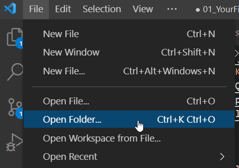

3. Navigate to your class folder
4. Create a new folder there called `My First Program`
5. Select the folder and open it

This should result in a new blank project opening in Visual Studio Code. It
should look similar to this:

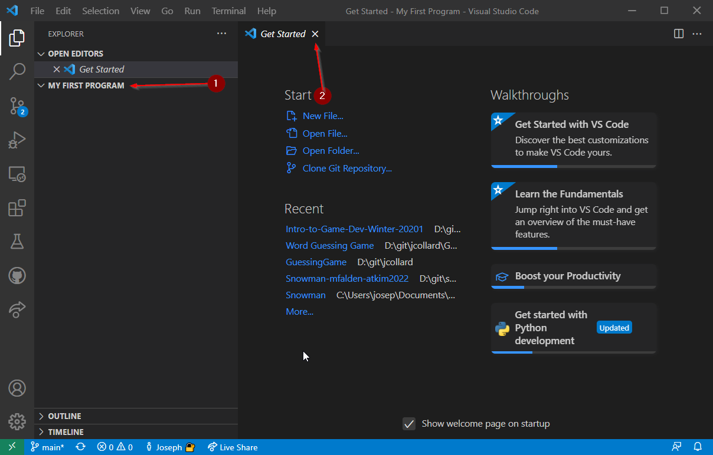

It probably won't look **EXACTLY** the same but it should be similar.

1. Verify you have a section on the left that says `My First Program` (or
   whatever the name of your project folder was).
2. Once you know you're in the right place. You can close the `Get Started` tab
   by clicking the `X` on that tab.

### Opening the Integrated Terminal

Now that VS Code is open in our project directory (directory is a fancy word for
folder), we can launch the Integrated Terminal.

There are several ways to do this, for now, we will use the top menu:

* From the top menu select `Terminal` > `New Terminal`

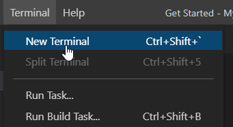

After clicking this:

1. A terminal tab should open
2. When on the terminal tab, it tells you which "shell" you're using. On mac the
   default is usually `zsh` or `bash`
3. You should be able to click into the area at the bottom of VS Code and type
   something in. When you type, it will appear at the end of the line.

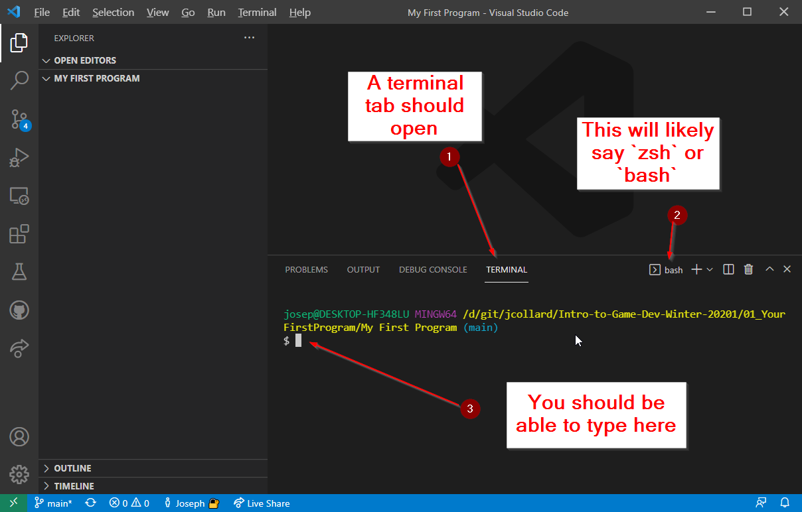

### Running Commands in the Terminal

Now that you have a terminal open. You can give commands to the operating
system. Often, the terminal is called the "Command Line" because you are able to
give commands to the operating system. Let's try it out:

#### **FIRST TASK**

Type the following commands into the terminal. After typing each command, take a
screenshot of the results and add it to this document.  Be sure to type the
command EXACTLY as listed. Be aware of the casing of the letters and spacing.

1. `echo "Hello world!"`

TODO: Delete this text and add your Screenshot here

2. `touch NewFile.txt`

TODO: Look in your file Explorer. What happened? Take a screenshot and add it
here

3. `date`

TODO: Delete this text and add your Screenshot here

### More on the Command Line

When you type something into the terminal and press enter, the text you entered
is sent to your operating system and the operating system tries to figure out
what to do with it. If there is a program associated with the first word
entered, that program runs and uses the remaining words as input to the program.

For example:

* The `echo` program simply echoes back whatever values it receives.
* The `touch` program creates a new file with the name that was provided.
* The `date` program displays the current date and time

### Running the .NET CLI

Now that you know a little bit more about the terminal, let's try running the
.NET CLI (command line interface).

If you type `dotnet` into the terminal, this tells the operating system to run
the .NET CLI. Try it now.

If all goes well, you should see something that looks like this:

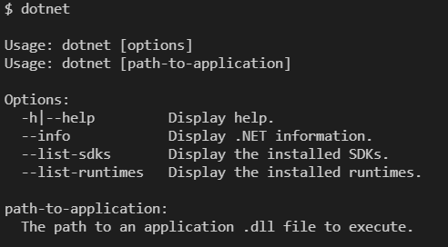

This tells us that the .NET CLI is installed and that the command by itself
doesn't do much. We must give it a few **arguments** for it to do anything
useful. To have it create a new C# project we can give it 2 arguments: `new` and
`console`. Let's try it:

* In the terminal enter `dotnet new console`.

If all goes well, you should see some output that looks similar to this:

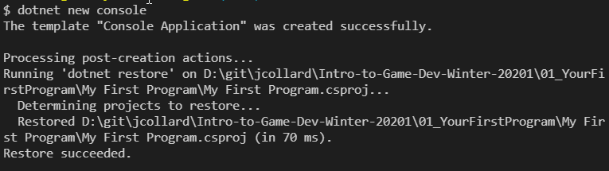

Additionally, you should see several new files created in your file explorer:

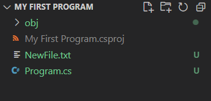

These files are the template files that .NET provides to make it easy to start
programming in C# right away. You could create these files manually and
everything would work exactly the same. However, it is such a common task that
Microsoft (the creators of C#) added the template so developers could start
programming right away.

### Running Your First Program

To run a C# project, you use the `dotnet` CLI and provide it with a single
argument `run`. Let's try it: 

* In the terminal enter `dotnet run`.

If all went well, you should see the output of the program "Hello World!"

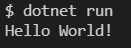

### Simplifying Your Program

When you give the command `dotnet run`, this causes all of the C# files in your
project to be "compiled" and then "executed". By default, the entry point for
our project is the `Program.cs` file. Let's modify it:

1. Open `Program.cs` by double clicking on it in the file explorer.
2. If all went well, you should see the programs code:

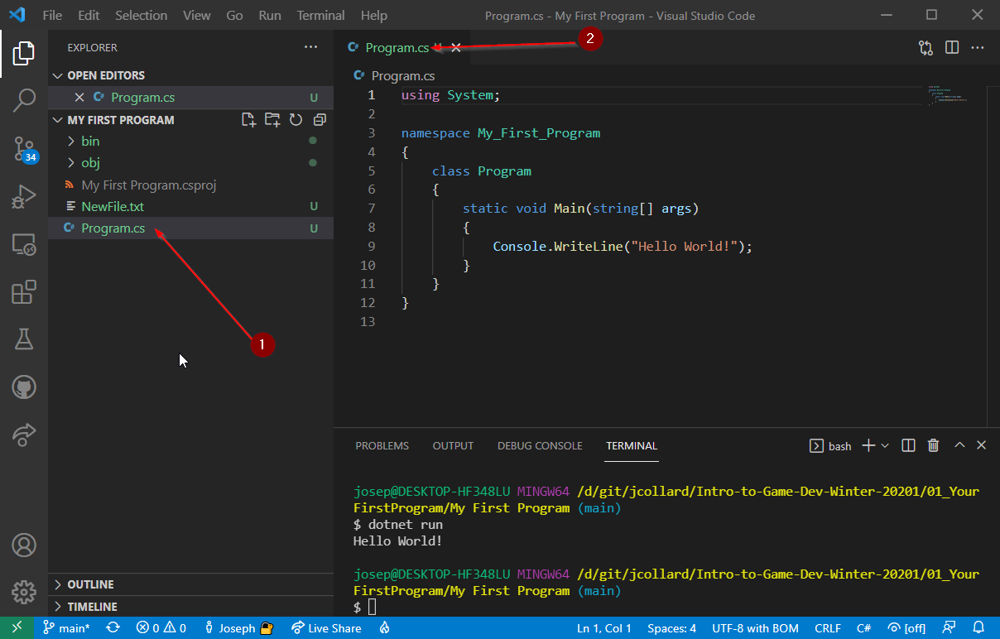

Remember the whole "Object Oriented" thing that I mentioned before? All of the
weird text here with `namespace` and `class` and `static void` is related to C#
being an "Object Oriented" programming language. We are going to ignore this for
now. 

1. Update your program to look like this:

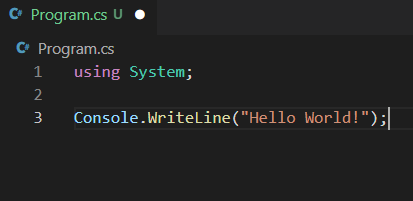

2. Save your work.
   * If you see a dot next to one of your filenames, this means your work is not
     saved.
   * To save, from the top menu select `File` > `Save All` (this will save
     everything). If this option is `grey` this means all files are saved
     already.
   * Optionally, you can select the `Auto Save` feature.

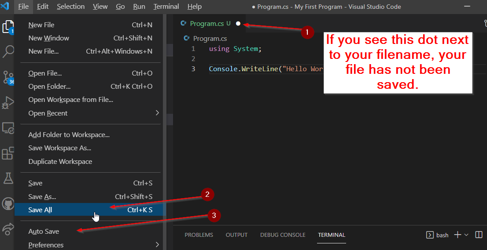

### Console.WriteLine()

Currently, our program is pretty simple. 

1. `using System;` - It loads a library called System
2. `Console.WriteLine("Hello World!");` - It outputs the text `Hello World!` to
   the console (terminal).

Let's add a new line to the program to output the text "This is my first
program.".

1. Add the line `Console.WriteLine("This is my first program.");`.
2. Save your work.

Note: The double quotes should surround the text you want to output **and** you
need to include a semi-colon at the very end of the line.

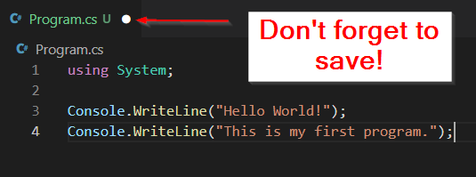

3. Finally, in the terminal run `dotnet run` to see the output.
4. If all went well you should see something that looks like this:

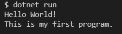

#### SECOND TASK - Two Truths and a Lie

Let's practice using `Console.WriteLine` to output a few more lines of text to
the console. As well as tell me a little bit more about yourself:

1. Write a line that displays your name.
2. Write a line that displays your ~~address and credit card number~~ favorite
   food.
3. Write 3 more lines, 2 of the lines should be true statements about yourself
   and 1 of the lines should be a lie.

** TODO: Take a Screenshot of your code and add it to this document **

** TODO: Run your program, take a screenshot of the output in the terminal, and
add it to this document **

Finally, take the screenshot output of your terminal and post it on Google
Classrooms Class Stream. Then, reply to some of your classmates posts letting
them know which of their statements you think is a lie.

Here is the output from my program:

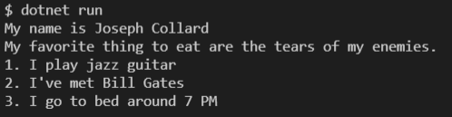