# Strings and Things

- [Strings and Things](#strings-and-things)
  - [Before Starting](#before-starting)
  - [Create a New Project](#create-a-new-project)
  - [What is a Variable](#what-is-a-variable)
    - [Integers in C](#integers-in-c)
    - [Understanding the Code](#understanding-the-code)
    - [Strings in C](#strings-in-c)
    - [Reading Integers using Console.ReadLine()](#reading-integers-using-consolereadline)
    - [Reading Integers using int.ParseInt()](#reading-integers-using-intparseint)
    - [Challenge 1: Area of a Rectangle](#challenge-1-area-of-a-rectangle)
    - [Challenge 2: Perimeter of a Rectangle](#challenge-2-perimeter-of-a-rectangle)
    - [Challenge 3: Character Creator](#challenge-3-character-creator)

## Before Starting 

Before starting this activity, you should be familiar with reading and writing
to the console using `Console.WriteLine` and `Console.ReadLine`. You can
familiarize yourself by completing the Mad Libs activity.

## Create a New Project

Start by creating a new project for this activity. If you need help with the
following steps, refer to the Mad Libs project.

1. Create a Folder called `Strings and Things`
2. In Visual Studio Code, open the folder.
3. Open an Integrated Terminal
4. In the Integrated Terminal, run the command `dotnet console new`
5. If all goes well, you will have a new project containing a `Program.cs` file.

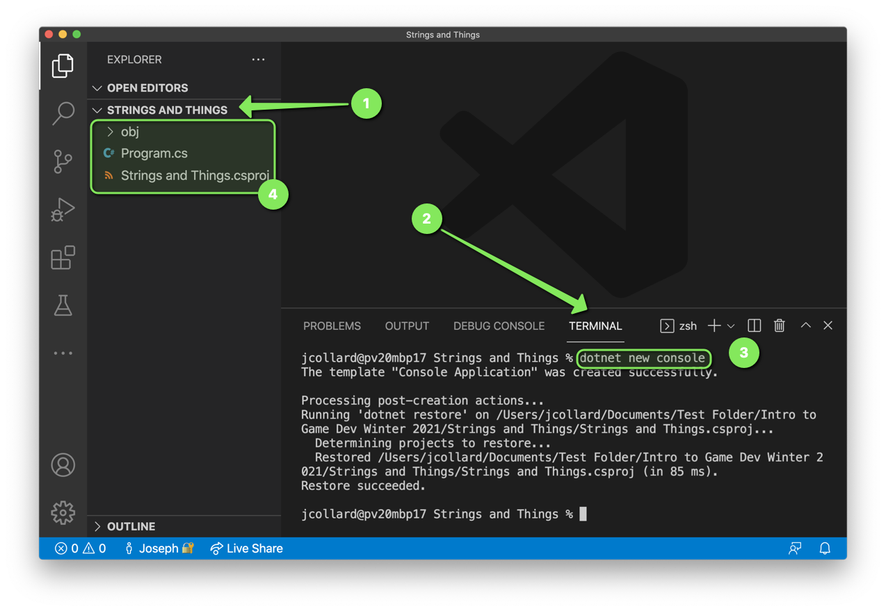

6. Simplify your `Program.cs` file to look like the following:

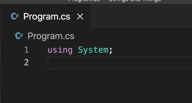

## What is a Variable

 You may have heard the term `variable` in a math class when talking about an
 equation. For example, you may have been asked to solve for `x` in the equation
 `x = 7 + 8`. In this example, `x` is the name of a some value that can be
 anything. To know the exact value, we must first "evaluate" the equation. In
 this case, if we evaluate the right hand side of the equation, we can find that
 `x` has a value of `15`.

 You may be asked to solve for `x` again, `x = 13 - 2`. Again, we don't know
 what the value of `x` is until we evaluate the equation. In this case, `x` has
 a value of `11`.

 Notice, the value of `x` can **vary** depending on the evaluation. This is why
 we call `x` a variable.

### Integers in C#

In C#, if you want to store a number you will often create an `int`. This is
short for "integer" which is a whole number (no decimals).

1. Update your code to create an `int` variable called `x`.
2. Update your code such that `x` is assigned the result of evaluating `5 + 7`
3. Update your code to write `x` to the console.

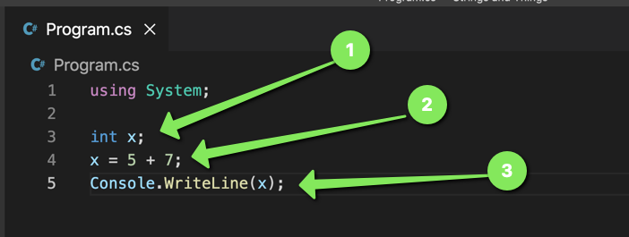

4. Save your work.
5. Run your code by running `dotnet run` in the terminal

If all went well, you should see the result `12` displayed in your console.

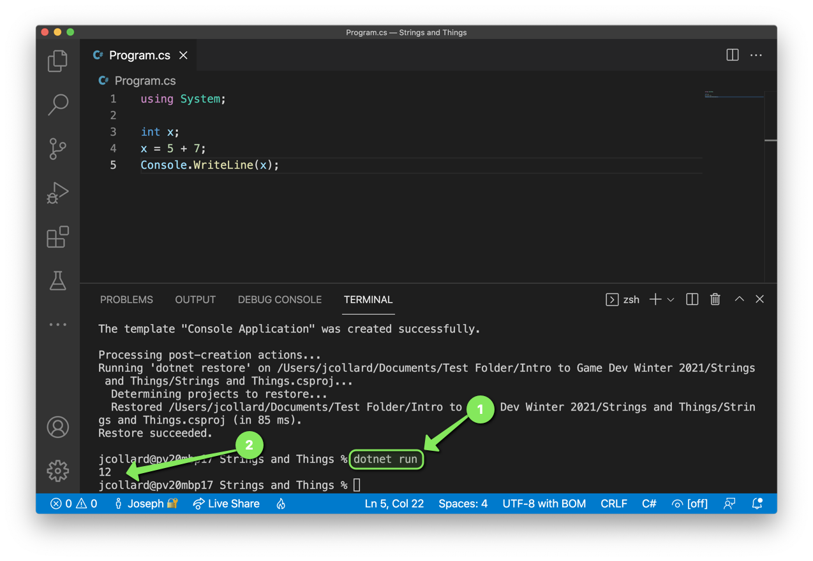

Let's add a few more integers and see what other operations we can perform with
them.

6. Update your code to create another `int` variable called `y`.
7. Update your code such that `y` is assigned the result of evaluating `x - 7`.
8. Update your code such that `x` is assigned the result of evaluating `y * 2`.
9. Update your code to create a third `int` variable called `z`.
10. Update your code such that `z` is assigned the result of evaluating `x / y`.
11. Update your code to write all three variables to the console.

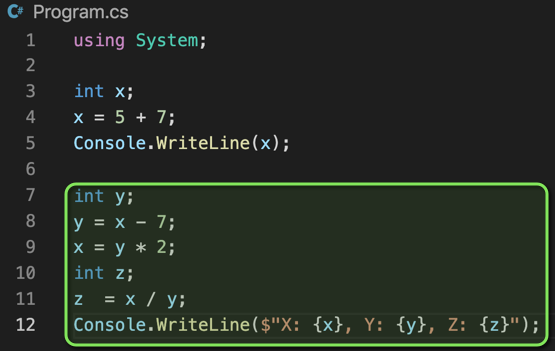

12. Save your work.
13. Run your code by running `dotnet run` in the terminal.

If all goes well, you should see the following output in your console:

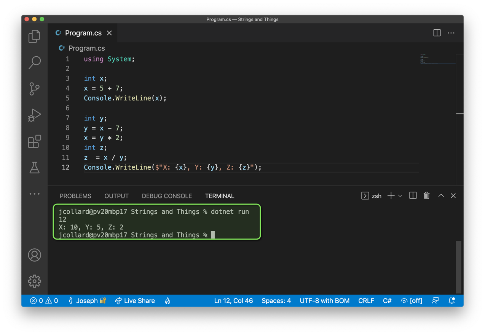

### Understanding the Code

Okay, so you added a bunch of new lines of code here. Let's break it down line
by line.

1. `int x;`

This line of code creates a new variable named `x` and tells the computer that
it can store an `integer` value. This is is called **Declaring a variable**.

2. `x = 5 + 7;`

This line of code assigns the result of evaluating `5 + 7` to the variable `x`.
In C# `=` is called the **Assignment Operator**. In C# when we use `+` with two
integers it is called the **Addition Operator**.

3. `Console.WriteLine(x);`

This line of code looks up the value stored in `x` (in this case 12) and writes
it to the console. In programming, we often call this **Printing**.

4. `int y;`

This line of code creates a new variable named `y` and tells the computer that
it can store an `integer` value.

7. `y = x - 7;`

This line of code assigns the result of evaluating `x - 7` to the variable `y`.
In this case we first lookup and substitute the value of `x` into the expression
becoming `12 - 7`, then `5`. In C# when we use `-` with two integers it is
called the **Subtraction Operator**

8. `x = y * 2;`

This line of code assigns the result of evaluating `y * 2` to the variable `x`.
In this case we first lookup and substitute the value of `y` into the expression
becoming `5 * 2`, then `10`. In C#, when we use `*` with two integers it is
called the **Multiplication Operator**.

9. `int z;`

This line of code creates a new variable named `z` and tells the computer that
it can store an `integer value`.

10. `z = x / y;`

This line of code assigns the result of evaluating `x / y` to the variable `z`.
In this case we first lookup and substitute the values of `x` and `y` into the
expression becoming `10 / 5`, then `2`. In C#, when we use `/` with two integers
it is called the **Division Operator**.

11. `Console.WriteLine($"X: {x}, Y: {y}, Z: {z}");`

This line of code first evaluates the expression `$"X: {x}, Y: {y}, Z: {z}"` and
then writes the result to the console. To evaluate the expression, we must
substitute the values of `x`, `y`, and `z`. This results in `"X: 10, Y: 5, Z:
2"`. Finally, this value is written to the console resulting in our output.


### Strings in C#

In C#, you can specify different types of variables. In the Mad Libs activity,
you created several `string` variables. A `string` is a variable that holds
text. To create a string within your program, you simply place text between
double quotes.

1. Update your code to create a `string` called `name`.
2. Update your code such that `name` is assigned `"Bob"`.
3. Update your code to write the value of `name` to the console.

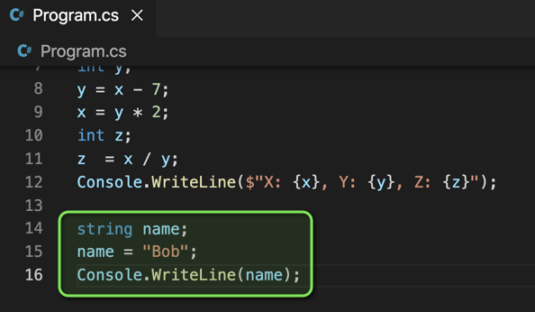

4. Save your code.
5. Run your program.

If all went well, you should see the following output:

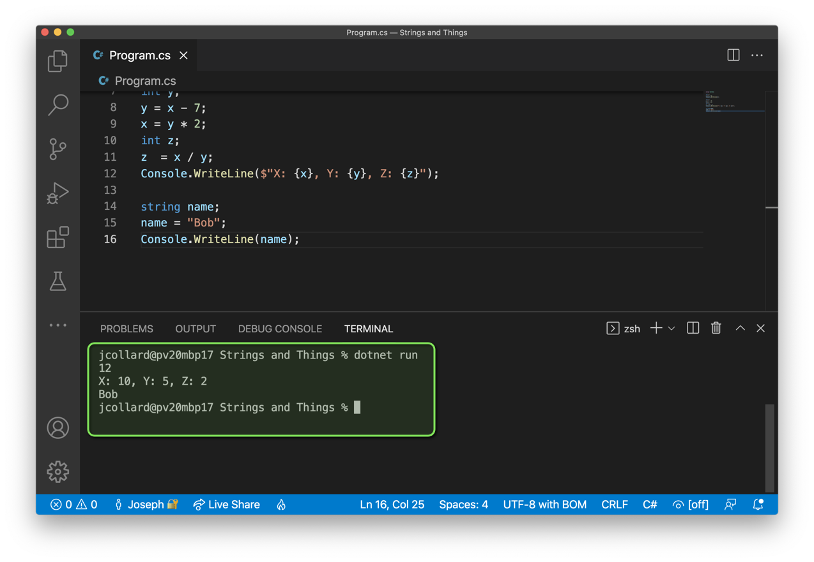

Next, let's add a few more string variables.

6. Update your code to create a `string` called `lastName`.
7. Update your code to create a `string` called `fullName`.
8. Update your code such that `lastName` is assigned `"Slob"`
9. Update your code such that `fullName` is assigned the result of evaluating
   `name + lastName`.
10. Update your code to write the value of `fullName` to the console.

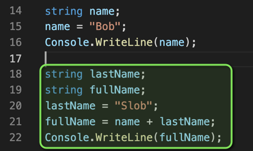

11. Save your code.
12. Run your program.

If all went well, you should see the following output:

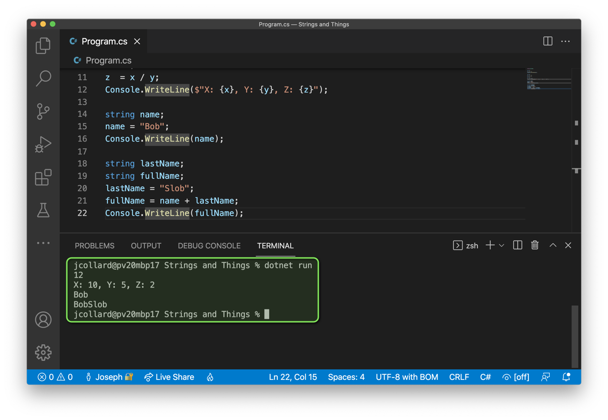

When we use the `+` operator on two strings, it is called the **Append
Operator**. You may see it called the **Concatenation Operator** as well.

Notice that when we use it on our two strings, it does not automatically put a
space between them.

13. Update your code such that `fullName` is assigned the result of evaluating
    `name + " " + lastName`.

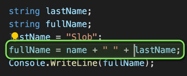

14. Save and Run your code.

If all went well, you should now see the following output:

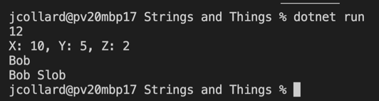

### Reading Integers using Console.ReadLine()

Awesome! We now have integers and strings. With these two data types, you can
write a variety of somewhat interesting programs. However, we must first learn
how to read integer input from the user.

If we try to store the value the user types into the terminal into an integer
variable, we will be greeted with an error.

1. Update your code to create a `string` variable called `age`.
2. Update your code to write a the message `"Enter your age: "` to the user.
3. Update your code such that `age` is assigned the result of evaluating
   `Console.ReadLine()`.

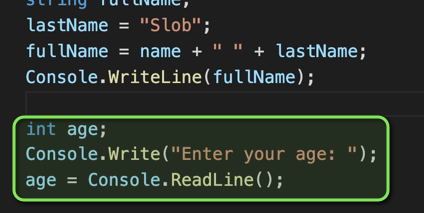

4. Save and Run your code.

If all went well, you should be greeted with an error:

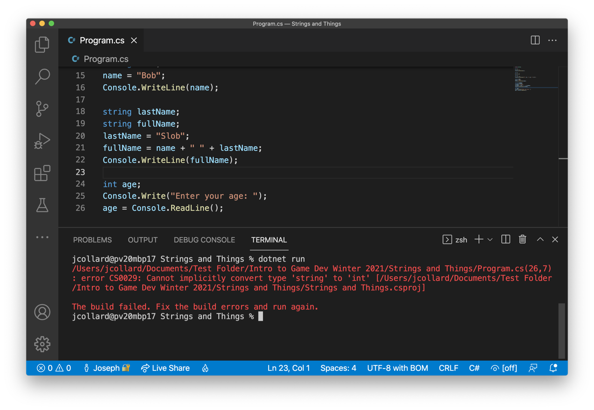

This error is a little challenging to decipher. But, let's take a closer look:

```
/Users/jcollard/Documents/Test Folder/Intro to Game Dev Winter 2021/Strings and Things/Program.cs(26,7): error CS0029: Cannot implicitly convert type 'string' to 'int' [/Users/jcollard/Documents/Test Folder/Intro to Game Dev Winter 2021/Strings and Things/Strings and Things.csproj]
```

The first thing the error will display is the name of the file where the error
occurred. In this case:

```
/Users/jcollard/Documents/Test Folder/Intro to Game Dev Winter 2021/Strings and Things/Program.cs(26,7): 
```

This is saying that there is a file on my computer located in a folder called
`/Users/jcollard/Documents/Test Folder/Intro to Game Dev Winter 2021/Strings and
Things/`. WHEW! That is a LONG path. We can essentially ignore this part.

Then, it says `Program.cs(26,7): `. This tells me that the error is occurring on
Line 26, Column 7 of my `Program.cs` file. **THIS** is useful information. If
nothing else, I now know which line is causing the problem.

Next, the error says

```
error CS0029: Cannot implicitly convert type 'string' to 'int'
```

The first part `error CS0029` is simply a code that tells us that in the User
Manual for C# that this falls into a category of error called "CS0029". A *VERY*
creative name!

Finally, the actual important part of the error is this: `Cannot implicitly
convert type 'string' to 'int'`. Hopefully, you recognize some of these words
(namely `int` and `string`). This error is telling us that `Console.ReadLine()`
evaluates to a `string` but the variable `age` can only store integer values.

Wow! That was a lot of work to figure out. BUT, we now know that we cannot store
the results of `Console.ReadLine()` directly into an `int` variable. Bummer!

### Reading Integers using int.ParseInt()

Okay. So, that was a complete and utter failure. Luckily, there is a method that
does what we need. `int.ParseInt()` is a method which converts `string` values
to `int` values.

1. Update your code to use `int.ParseInt()` to convert the results from
   `Console.ReadLine()` to an `int`
2. Update your code to write the message, $"Wow! You're {age}?".

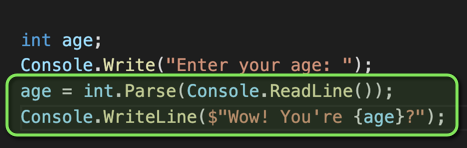

3. Save and Run your code.
4. When prompted, enter your age.

If all went well, you should see output similar to this:

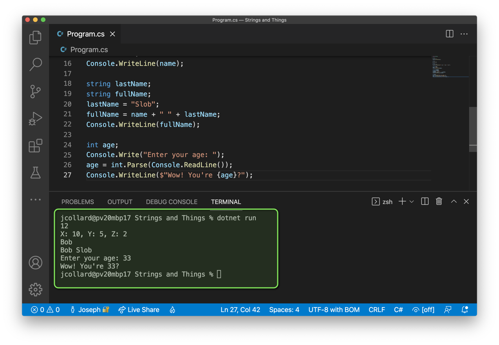

Awesome! You can now read integers and strings using the terminal.

### Challenge 1: Area of a Rectangle

In this challenge, you will write a program which prompts the user to enter the
width and height of a rectangle. It will then calculate the total area of the
rectangle.

1. Create a new folder called "Rectangle Analyzer"
2. Open the folder in Visual Studio Code
3. Open the Integrated Terminal
4. Create a new C# console project (`dotnet new console`)
5. Update your Program.cs file to do the following:
6. Display "I can calculate the area of a rectangle!"
7. Prompt the user "Enter the rectangle's width: "
8. Read user input and save the value in an int variable.
9. Prompt the user "Enter the rectangle's height: "
10. Read user input and save the value in an int variable.
11. Calculate the area by multiplying the width and height.
12. Store the results in another variable.
13. Display $"The total area of the rectangle is {area}."

When you're finished, your VS Code project should look similar to this:

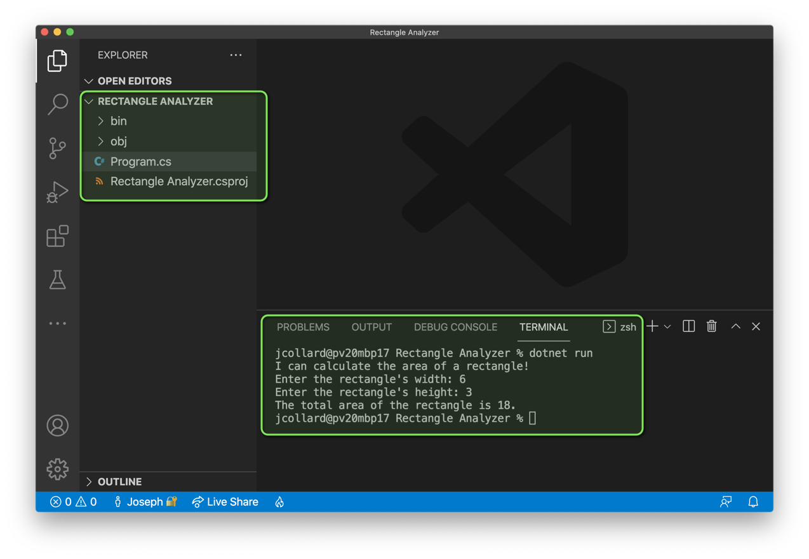

After completing this challenge, upload a screenshot of your workspace that
includes your `Explorer`, your `Program.cs` source code, and the output from
running your program.

**ADD YOUR SCREENSHOT HERE**

### Challenge 2: Perimeter of a Rectangle

In this challenge, you will update your "Rectangle Analyzer" code to also
calculate the perimeter of the specified rectangle and output the results.

1. Update your code to calculate the perimeter of the rectangle (2 * width + 2 *
   height) and stores the value in a new variable.
2. Update your code to also display $"The perimeter of the rectangle is
   {perimeter}"

When you're finished your output should look similar to this:

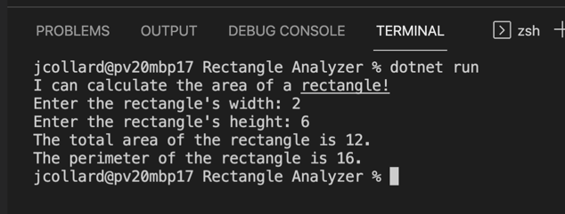

After completing this challenge, upload a screenshot of your workspace that
includes your `Explorer`, your `Program.cs` source code, and the output from
running your program.

**ADD YOUR SCREENSHOT HERE**

### Challenge 3: Character Creator

In this challenge, you will create a basic program where a user can specify
information for a character for a video game.

1. Create a new folder called "Character Creator"
2. Open your folder in VS Code
3. Open the Integrated Terminal
4. Create a new C# Project
5. Your program should do the following:
6. Display a message "Welcome to Character Creator:"
7. Prompt the user to enter at least 5 different values. At least 2 of the
   values must be strings and at least 2 of the values must be integers.
8. Display a message to the user showing all of the characters information.
9. Save your program.
10. Run your program.

When you're finished, your output should look similar to this:

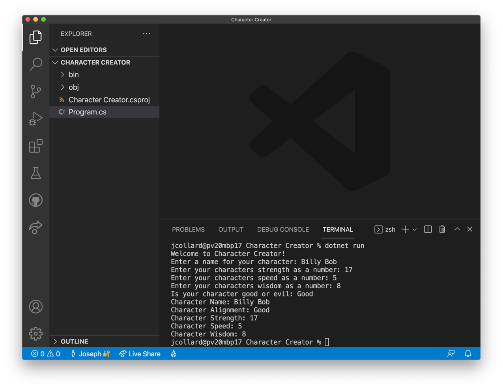

After completing this challenge, upload a screenshot of your workspace that
includes your `Explorer`, your `Program.cs` source code, and the output from
running your program.

**ADD YOUR SCREENSHOT HERE**