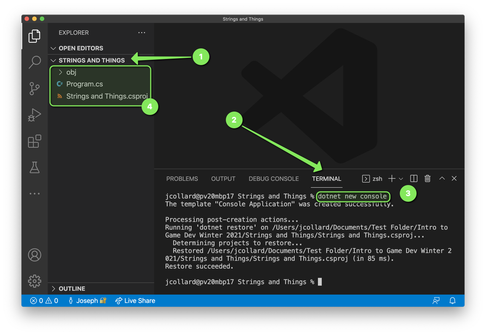
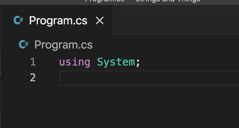
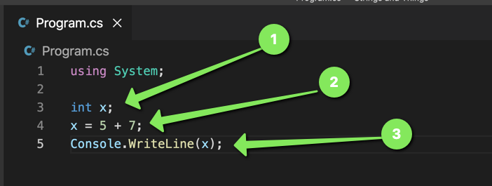

# Strings and Things

## Before Starting 

Before starting this activity, you should be familiar with reading and writing
to the console using `Console.WriteLine` and `Console.ReadLine`. You can
familiarize yourself by completing the Mad Libs activity.

## Create a New Project

Start by creating a new project for this activity. If you 
need help with the following steps, refer to the Mad Libs
project.

1. Create a Folder called `Strings and Things`
2. In Visual Studio Code, open the folder.
3. Open an Integrated Terminal
4. In the Integrated Terminal, run the command `dotnet console new`
5. If all goes well, you will have a new project containing a `Program.cs` file.

6. Simplify your `Program.cs` file to look like the following:

## What is a Variable

 You may have heard the term `variable` in a math class when talking about an
 equation. For example, you may have been asked to solve for `x` in the equation
 `x = 7 + 8`. In this example, `x` is the name of a some value that can be
 anything. To know the exact value, we must first "evaluate" the equation. In
 this case, if we evaluate the right hand side of the equation, we can find that
 `x` has a value of `15`.

 You may be asked to solve for `x` again, `x = 13 - 2`. Again, we don't know
 what the value of `x` is until we evaluate the equation. In this case, `x` has
 a value of `11`.

 Notice, the value of `x` can **vary** depending on the evaluation. This is why
 we call `x` a variable.

### Variables in C#

When you want to store information in a computer program, you will often use a
`variable`. In C#, if you want to store a number you will often create an `int`. This is short for "integer" which is a whole number (no decimals).

1. Update your code to create an `int` variable called `x`.
2. Update your code such that `x` is assigned the result of evaluating `5 + 7`
3. Update your code to write `x` to the console.

4. Save your work.
5. Run your code by running `dotnet run` in the terminal

