# All About Floats

## Before Starting

Before you start this activity, you should be familiar with the following:

* Creating `string` and `int` variables.
* Reading and Writing using the `Console.WriteLine()` and `Console.ReadLine()`
  methods.
* Converting `string`s to `int`s using the `int.Parse()` method.
* Using the **arithmetic operators** `+`, `-`, `/`, and `*` operators with `int`
  values
* Using the **append operator** (`+`) with `string` values

To familiarize yourself with these things, you should complete the "Integers and
Strings" activity.

## Create a New C# Console Project

Start by making a new project for this activity.

1. Create a folder called "All About Floats"
2. Open your folder in VS Code
3. Open the Integrated Terminal
4. Create a new C# console project by running `dotnet new console`

## Remainder Operator (modulus arithmetic)

Recall from the "Integers and Strings" activity that an `int` value can only
store whole numbers. This means that we cannot store fractional values like
`1/2` or `.234`.

Let's see what that looks like.

1. Update your `Program.cs` file to match the code below:

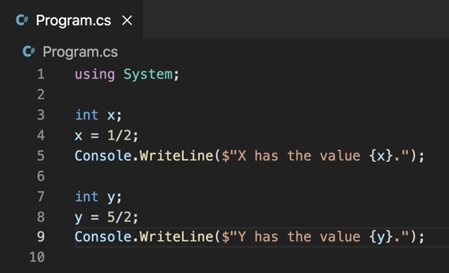

2. Save and run your program by running `dotnet run`

If all went well, the output should look like this:

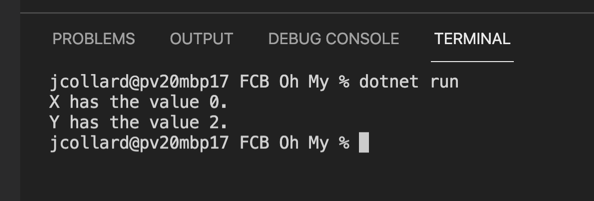

Notice that `1/2` becomes `0` and `5/2` becomes `2`. When you perform division
on integer values, you will always get back the result rounded down.

Think way back to when you were learning to divide numbers using long division.
You would end up with a value called the "remainder". We can calculate the
remainder of division using the `%` operator. This is called the "**Remainder
Operator**" or "**Modulus**".

Let's update our code to calculate the remainder of our values:

3. Update your `Program.cs` file to match the code below:

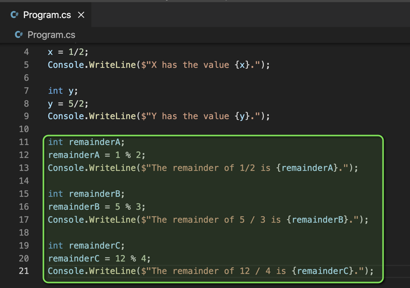

4. Save and run your program

If all goes well, your output should look similar to this:

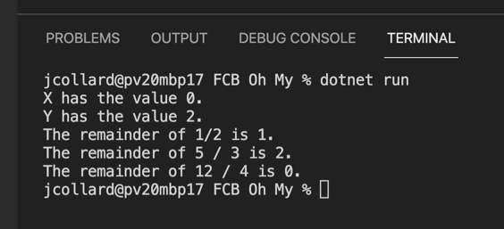

## Floating Point Numbers

Alright, so you now know that `int` values can only store whole numbers and you
also know how to calculate the remainder of dividing two `int` values. What if
we want to store a fractional number? To do this, we use something called a
"**Floating Point Number**". In programming, we often call these "floats". This
is because many programming languages use the `float` keyword to store floating
point values.

Let's add a few floats and see what they look like:

1. Update your `Program.cs` file to match the code below:

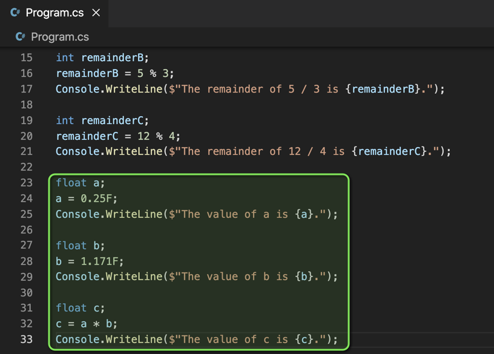

Notice, that when we specify a value to be a float, we must put an `F` at the
end of the value. This tells the computer to treat it as a floating point value.
If we don't put an `F`, we will receive an error message.

2. Save and run your program

If all goes well, you will see the following output:

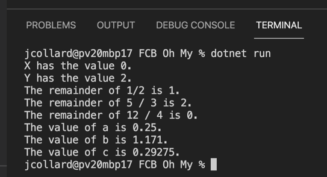

## Why is it called a Float?

You might be telling yourself, "Wow... float is a really weird name." I know I
thought that when I first started programming. Why not "number" or "fraction"
or... ANYTHING ELSE! 

Well... it turns out it is actually a pretty reasonable name. They're called
"Floating Point Numbers" because they "float" near the actual value. That is, a
`float` is not always exactly the number you expect it to be. Instead, a
floating point number is only an **estimation** of the actual value. Let's write
some code to demonstrate this estimation:

1. Update your program to have the following code:

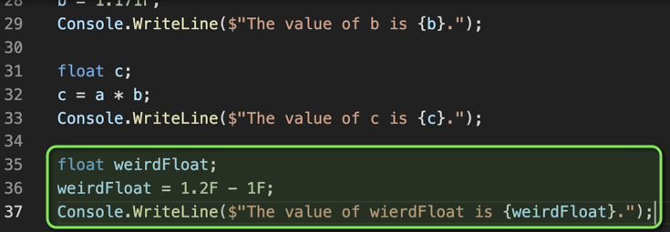

2. What do you think the output should be? Don't run your program yet! Take a
   guess.

**WRITE YOUR ANSWER HERE**

3. Save and run your program.

**TAKE A SCREENSHOT OF YOUR PROGRAMS OUTPUT AND PUT IT HERE**

Weird! But, now you know that computers are not very good at doing math with
`float`s. If you need something to be precise, you will need to use `int`
values.

## Reading Floats using Console.ReadLine()

Just like `int`, `float` has a `Parse()` method which allows us to convert a string entered by the user into a `float`. Let's practice that now:

1. Update your code with the following:

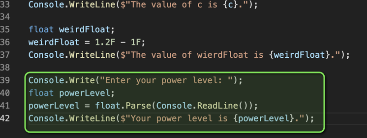

2. Save and run your program.
3. When prompted, enter a float value.

If all went well, your output should look something like this:

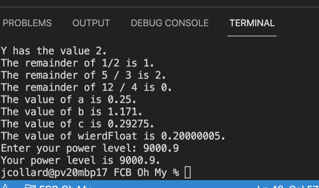

## Challenge 1: Area of a Circle

In this challenge, you will write a program to calculate the area of a circle. The area of a circle can be calculated by multiplying its pi by its radius squared.

1. Create a new folder called "Circle Analyzer"
2. Open the folder in VS Code
3. Open an Integrated Terminal
4. Create a new C# Project (`dotnet new console`)
5. Write a program that does the following:
6. Displays `"I can analyze a circle!"`
7. Prompts the user `"Enter the circles diameter: "`
8. Creates a `float` variable called `diameter`
9. Calls `float.Parse(Console.ReadLine())` and stores the result in the `diameter` variable.
10. Creates another `float` called `radius`.
11. Stores the result of `diameter / 2F` in the `radius` variable.
12. Creates a third `float` called `pi`.
13. Stores the value `3.14159265359F` in the `pi` variable.
14. Creates a third `float` called `area`.
15. Stores the result of `pi * radius * radius` in the variable area
16. Finally, display `$"The area of the circle is {area}"`

Save your work and run it to make sure it works.

If all went well, your output should look similar to this:

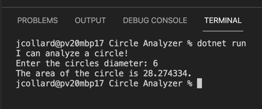

When you're finished, you should take a screenshot of your Visual Studio Code. The screenshot should include:

1. Your File Explorer showing your project files expanded.
2. Your `Program.cs` file source code.
3. The output of your program being run in the terminal.

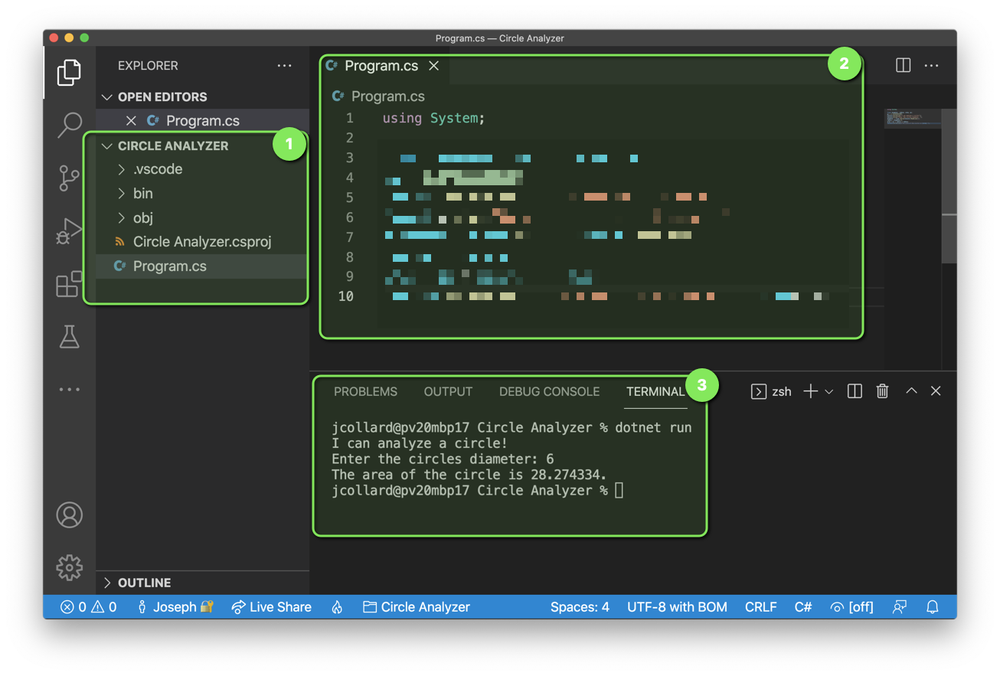

**ADD A SCREENSHOT OF YOUR VISUAL STUDIO CODE HERE**

## Challenge 2: How Fast is the Flash?

In this challenge, you will update your Circle Analyzer program to calculate how fast the flash can run around the Earth. To do this, you will need to determine the circumference of the Earth and the speed at which the Flash can run.

* Hint: The diameter of the Earth is 7917.5 miles!
* Hint: The circumference of a circle is `2 * pi * radius`.
* Hint: The Flash can run at 2,532 miles per hour!

1. Add three `float` variables to your program: `speed`, `circumference`, and `time`
2. After the area of the circle is displayed, prompt the user "How fast can you run: "
3. Call `float.Parse(Console.ReadLine())` and store the result in the `speed` variable.
4. Calculate the `circumference` of the circle.
5. Calculate the `time` as `circumference / speed`
6. Display a message to the user letting them know the circumference of the circle.
7. Display a message letting them know how long it would take to run around the circle.
8. Finally, use your program to calculate how much time it would take for the Flash to run around the Earth.

Save your work and run it to make sure it works.

When you're finished, you should take a screenshot of your Visual Studio Code. The screenshot should include:

1. Your File Explorer showing your project files expanded.
2. Your `Program.cs` file source code.
3. The output of your program being run in the terminal.

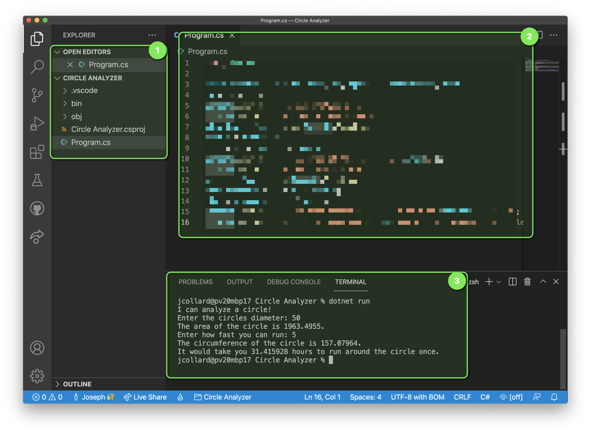

**ADD A SCREENSHOT OF YOUR VISUAL STUDIO CODE HERE**
