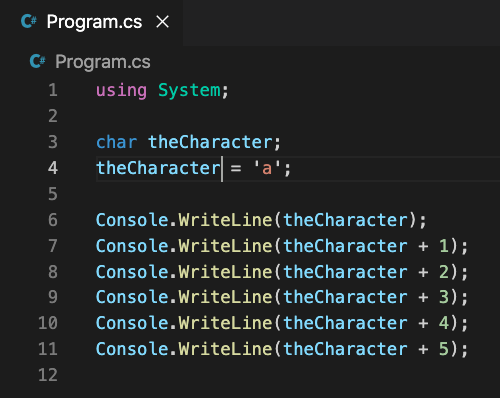
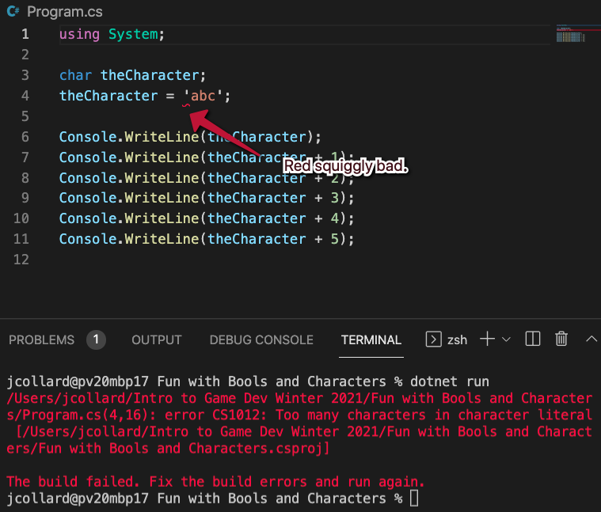
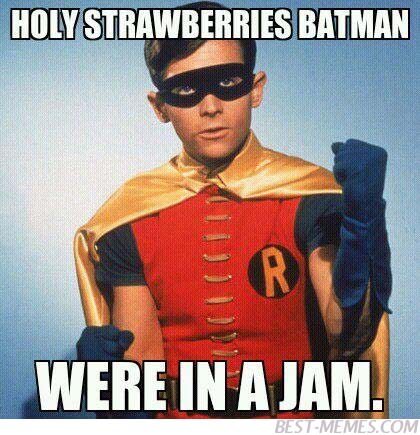
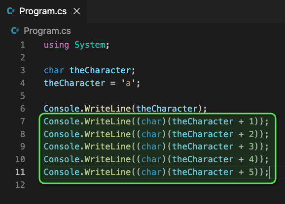
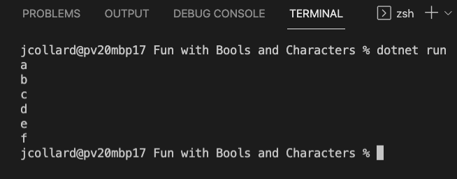
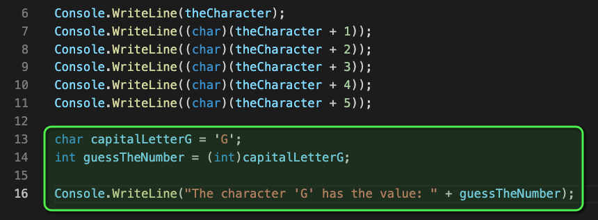
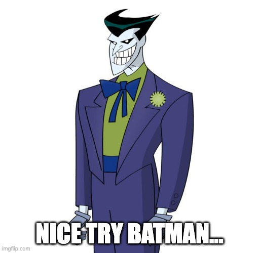
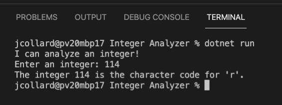
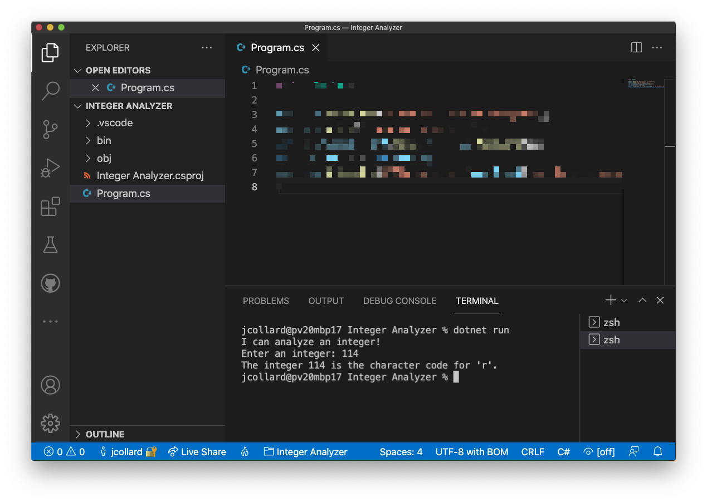

# The Mysterious Origin Story of a Character

## Before Starting this Activity

Before you start this activity, you should be familiar with the following:

* Creating `string`, `int`, and `float` variables.
* Reading and Writing using the `Console.WriteLine()` and `Console.ReadLine()`
  methods.
* Converting `string`s to `int`s and `float`s
* Using the **arithmetic operators** `+`, `-`, `/`, `*`, and `%` operators with
  `int`s and `float`s
* Using the **append operator** (`+`) with `string` values

To familiarize yourself with these things, you should complete the "All About
Floats" activity.

## Create a New C# Console Project

Start by making a new project for this activity.

1. Create a folder called "Fun with Bools and Characters"
2. Open your folder in VS Code
3. Open the Integrated Terminal
4. Create a new C# console project by running `dotnet new console`

## The mysterious super powers of a Character

So far, we have used two numeric types and one non-numeric type to write our C#
programs:

* Integers (`int`) - Whole numbers
* Floating Point Numbers (`float`) - Estimated decimal numbers
* Strings (`string`) - Text that can be written to the screen

There are many more data types and most of them fall into one of these two
categories: numeric / non-numeric.

However, there is a data type called a "Character" which is a little mysterious
(kind of like Batman). It is not quite a number and it is not quite not a number
(kind of like the way Batman is a superhero but he doesn't have super powers...
unless being super rich is a super power).

So... what is this mysterious data type? Let's take a look:

### My First Character

1. Update your `Program.cs` file to match the one below (don't run it yet!):



2. Save your work but don't run your program just yet.

Just look at the code and think about it for a minute. What do you think the
program will write to the console? Take a guess!

**WRITE YOUR GUESS HERE**

3. Okay, now that you've guessed what you think it will do, run the program.

4. Take a screenshot of the output and add it to this document

**PUT YOUR SCREENSHOT HERE**

### Understanding The Code

Okay... so this seems a little strange. The output is probably not what you were
expecting. AND if you managed to guess exactly what the output would be you must
have the ability to see the future, **NICE**! For the rest us
[plebeian](https://www.google.com/search?q=define+plebeian)'s, here is an
explanation of what is happening:

1. On line 3, we wrote `char theCharacter;`.

This code is creating a variable called `theCharacter` that will store a
Character.

Just like integers and floating point numbers, there is an abbreviation for the
data type. In this case, `char` which is short for "Character" thus it is
pronounced "care". However, if you pronounce it "char" like "charcoal" I will
only judge you a little.

2. On line 4, we wrote `theCharacter = 'a';`

This assigns (`=`) the value `'a'` to be stored in the variable `theCharacter`.
Notice, the `'a'` is wrapped in single quotes (not double quotes). You may have
run into an error while trying to copy the code previously. This is because
double quotes (`"`) are used with `string` types and single quotes (`'`) are
used with `char` types.

Unlike `string`s a `char` is limited to a single letter (or symbol or letter).
Try it... if you try to write `'abc'` you will receive an error message.



3. On line 6, we wrote `Console.WriteLine(theCharacter);`

This writes the character to the terminal on its own line. In this case, the
letter `a` is displayed. This makes perfect sense.

Okay... this is where things get weird:

4. On line 7, we wrote `Console.WriteLine(theCharacter + 1);`

What does it even mean to add `a` and `1` together? This is non-sense...



Okay... so here is what is happening. It turns out that characters are actually
just numbers that have a special meaning. In this case, a lower case `a` has the
value `97`. When you tell the computer to add `1` to the character `a` the
computer just converts it to an integer and adds `1` resulting in `97 + 1`
ultimately writing the number `98` to the terminal in this situation.

The remaining lines of code follow the same logic as above.

### Why is `a` 97? ASCII's origin story

Okay... so you might be asking yourself... why is `a` the number `97` and not
the number `1`? 

Aaaaand... I cannot give you a particularly good reason except that a long time
ago in a galaxy not so far away not all computers used the same numbers to
represent the same characters. For example, some computers did in fact use `1`
to represent `a` and others used `16` and others used `27`. This resulted in a
whole giant mess of incompatible computer programs.

So, in 1981 a group of computer scientists came together and standardized how
computers will represent characters. The called this protocol called American
Standard Code For Information Interchange or "ASCII" (pronounced as-key). And
thus... `a` became `97`. 

ASCII only accounted for 128 symbols and later 256 symbols. Which turned out to
not be enough symbols. So later another protocol was invented called UTF-8 which
can represent 1,112,064 symbols and is the current character definition used by
**most** computers.

So, the answer is essentially "because some guy said so".

### Converting integers to characters

Okay, so we can actually convert characters to integers and integers to
characters pretty easily. When we do this, we call this "casting". Let's see
what that looks like:

1. Update your code to match the following:



2. Save your code and run it.

If all went well, you should see the beginning of the alphabet being written to
the terminal:



To tell the computer that you want to treat an integer as a character, you add
the code `(char)` in front of the integer. The same thing can be done to "cast"
integers as characters.

3. Update your code to add the following (note the letter is a capital G, this
   is important)



4. Save your code but don't run it yet.

What do you think the code on line 16 will write to the console?

**WRITE YOUR GUESS HERE**

5. Run your code

Did you get fooled again!?



You may have guessed `102` because you previously saw that `g` gave the value
`102` when you ran your code earlier. However, `g` and `G` are different
symbols. The computer doesn't care (nor does it really know) that `g` and `G`
are related. To the computer, these two values are as different as `71` and
`102`!

## Challenge 1: Integer Analyzer

In this challenge, you will write a program which asks the user to enter a
number. Then, converts the number to a character and displays the result.

1. Create a new folder called "Integer Analyzer"
2. Open the folder in VS Code
3. Open an Integrated Terminal
4. Create a new C# Project (`dotnet new console`)
5. Write a program that does the following:
6. Displays, `"I can analyze an integer!"`
7. Prompts the user `"Enter an integer"`
8. Creates a `int` variable called `userInput`
9. Calls `int.Parse(Console.ReadLine())` and stores the result in `userInput`
10. Creates a `char` variable called `asChar`
11. Casts `(char)userInput` and stores the result in `asChar`
12. Finally, displays `$"The integer {userInput} is the character code for
    '{asChar}'."

Save your work and run it to make sure it works.

If all went well, your output should look similar to this:




When you're finished, you should take a screenshot of your Visual Studio Code.
The screenshot should include:

1. Your File Explorer showing your project files expanded.
2. Your `Program.cs` file source code.
3. The output of your program being run in the terminal.



**ADD A SCREENSHOT OF YOUR VISUAL STUDIO CODE HERE**

## Challenge 2: Decode a Secret Message

Oh no! It seems the Riddler is up to no good! Batman has found several clues
around the city but they've been encoded as integers. Using your `Integer
Analyzer` help Batman solve the Riddler's puzzle?

```
  73 110  32 121 111 117 114  32 119 101
  98  32  98 114 111 119 115 101 114  32
 103 111  32 116 111  58  32 104 116 116
 112 115  58  47  47 116 105 110 121  46
 111 110 101  47 115 111 108 117 116 105
 111 110
```

When you're finished, add your solution to this document:

**WRITE YOUR SOLUTION HERE**